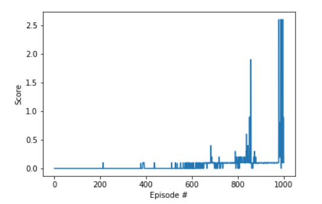
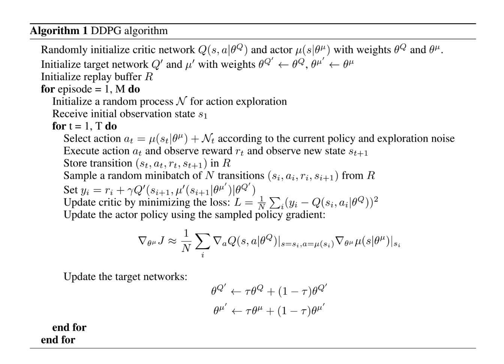
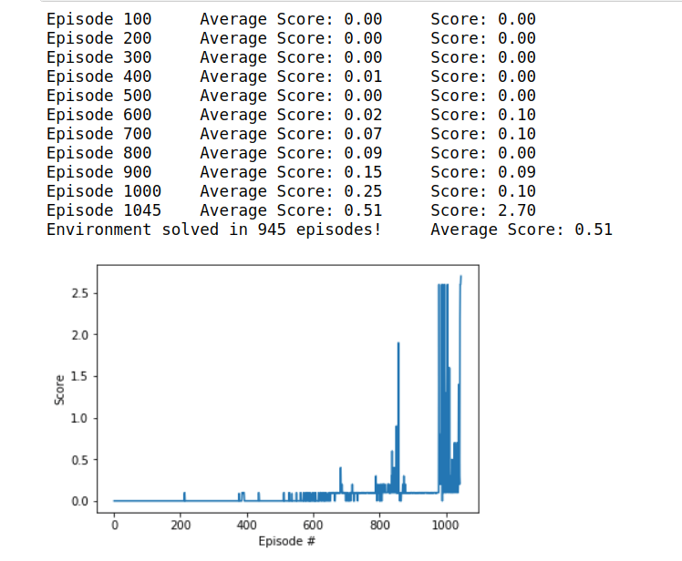
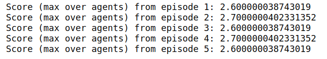

# Multi-agent Udacity Project Report
The goal is to get two tennis agents to keep the ball in the air
## Discussion of Methods Attempted
I began with the DDPG code from the Continuous Control project as a base.
### Method Log:
I adapted the Continuous Control code to score for max of the scores instead of the average and ran the DDGP algorithm for 1000 time steps. It appears to have solved the environment.

<br>


It's interesting there are some sections with very high relative results. It also appears my previous "kitchen sink" approach (just try everything) to solving the continuous control environment generalizes well.


## Method used
### DDPG Algorithm:
[Lillicrap et al. 2016](http://arxiv.org/abs/1509.02971)


### Hyper-parameters
| Hyper-parameter | Value | Comment
| :------------- | :------------- | :-------------- |
| BUFFER_SIZE | int(1e6)  | replay buffer size|
| BATCH_SIZE    | 128   | minibatch size    |
|GAMMA | 0.98  | discount factor|        
|TAU | 1e-3  | for soft update of target parameters   |         
|LR_ACTOR | 1e-4 |  learning rate of the actor |      
|LR_CRITIC | 1e-3 | learning rate of the critic |      
|WEIGHT_DECAY | 0  | L2 weight decay |  
|replay_batch | 1   | number of times per step to update (20 agents)|
|Epsilon | np.linspace(1,0.01,60000) |  previous setting|

### Network Architecture
#### Actor
```Python
print(agent.actor_local)

Actor(
  (bn0): BatchNorm1d(33, eps=1e-05, momentum=0.1, affine=True, track_running_stats=True)
  (fc1): Linear(in_features=33, out_features=400, bias=True)
  (bn1): BatchNorm1d(400, eps=1e-05, momentum=0.1, affine=True, track_running_stats=True)
  (fc2): Linear(in_features=400, out_features=300, bias=True)
  (bn2): BatchNorm1d(300, eps=1e-05, momentum=0.1, affine=True, track_running_stats=True)
  (fc3): Linear(in_features=300, out_features=4, bias=True)
)
```
#### Critic
```Python
print(agent.critic_local)

Critic(
  (fcs1): Linear(in_features=33, out_features=256, bias=True)
  (fc2): Linear(in_features=260, out_features=256, bias=True)
  (fc3): Linear(in_features=256, out_features=128, bias=True)
  (fc4): Linear(in_features=128, out_features=1, bias=True)
)
```


## Results
Scores are calculated by taking the max of the two players for each episode.

I ended learning when the mean of the last 100 scores was greater than 0.5. The environment solved in 945 episodes.


When I ran the trained agent, I noticed the scores oscillating. I believe the agents are optimized for certain specific ball reset points.


## Ideas for Future Work
I would like to implement MADDPG and test if the agents can learn in a competitive setting.

In general, I still don't have much of an intuition of how the architecture of the networks or hyper-parameter settings affect performance. I'd like to take some time and compare extremes.

I'm glad I was able to get a solution, but I'm looking forward to reworking with different implementations.

## Citations
Lillicrap, Timothy P., Jonathan J. Hunt, Alexander Pritzel, Nicolas Heess, Tom Erez, Yuval Tassa, David Silver, and Daan Wierstra. 2015. “Continuous Control with Deep Reinforcement Learning.” arXiv [cs.LG]. arXiv. http://arxiv.org/abs/1509.02971.

Duan, Yan, Xi Chen, Rein Houthooft, John Schulman, and Pieter Abbeel. 2016. “Benchmarking Deep Reinforcement Learning for Continuous Control.” arXiv [cs.LG]. arXiv. http://arxiv.org/abs/1604.06778.

Schulman, John, Philipp Moritz, Sergey Levine, Michael Jordan, and Pieter Abbeel. 2015. “High-Dimensional Continuous Control Using Generalized Advantage Estimation.” arXiv [cs.LG]. arXiv. http://arxiv.org/abs/1506.02438.

Gu, Shixiang, Timothy Lillicrap, Zoubin Ghahramani, Richard E. Turner, and Sergey Levine. 2016. “Q-Prop: Sample-Efficient Policy Gradient with An Off-Policy Critic.” arXiv [cs.LG]. arXiv. http://arxiv.org/abs/1611.02247.

Mnih, Volodymyr, Koray Kavukcuoglu, David Silver, Andrei A. Rusu, Joel Veness, Marc G. Bellemare, Alex Graves, et al. 2015. “Human-Level Control through Deep Reinforcement Learning.” Nature 518 (7540): 529–33.

Sutton, Richard S., and Andrew G. Barto. 1998. Introduction to Reinforcement Learning. Vol. 135. MIT press Cambridge.

Deep-Reinforcement-Learning. n.d. Github. Accessed February 20, 2019. https://github.com/udacity/deep-reinforcement-learning.

Zhang, Shangtong. n.d. DeepRL. Github. Accessed February 20, 2019. https://github.com/ShangtongZhang/DeepRL.
